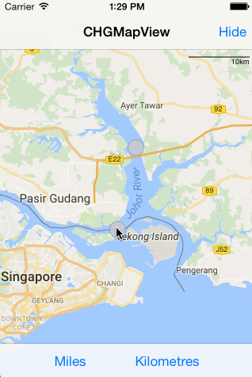

 `There is another implemantation wich will better mimic the scale behavior for GMSMapView at` https://github.com/grethi/CHGMapView.

# CHGMapViewScale

[](http://cocoapods.org/pods/CHGMapViewScale)
[](http://cocoapods.org/pods/CHGMapViewScale)
[](http://cocoapods.org/pods/CHGMapViewScale)

## Restrictions

This pod will only work with GoogleMaps < 2.0.0. Tested on iOS 7 to iOS 10.3.

## Example



To run the example project, clone the repo, and run `pod install` from the Example directory first.

## Requirements

This pod has dependencies to the GoogleMaps framework and the pod BlocksKit.

## Installation

CHGMapViewScale is available through [CocoaPods](http://cocoapods.org). To install
it, simply add the following line to your Podfile:

```ruby
pod "CHGMapViewScale"
```

## Usage

There are two different ways to use the scale:

* directly (Example: GMSMapViewController):

```objc
// create a new scale for a specific GMSMapView
_mapViewScale = [[CHGMapViewScale alloc] initWithMapView:_mapView];
// customize the scale
_mapViewScale.scalePosition = CHGMapViewScalePositionTopRight;
_mapViewScale.topAdjustment = CGRectGetHeight(self.navigationController.navigationBar.bounds) + 30.f;
// update the scale
[_mapViewScale update];
```

* or wrapped in CHGMapView (Example: CHGMapViewController)
```objc
// create a new CHGMapView based on GMSMapView. The scale is automatically available but invisible.
_mapView = [CHGMapView mapWithFrame:CGRectZero camera:camera];
self.view = _mapView;

_mapView.delegate = self;

// customize the scale
_mapView.scale.scalePosition = CHGMapViewScalePositionTopRight;
_mapView.scale.topAdjustment = CGRectGetHeight(self.navigationController.navigationBar.bounds) + 30.f;

// finally show the scale
[_mapView showScaleWithAutomaticUpdates:YES];
```

## Customize the scale view

### Scale unit (Default: Miles)

```objc
_mapView.scale.scaleUnit = CHGMapViewScaleUnitMiles;
```

### Position (Default: TopCenter and 30px from top of view)

```objc
_mapView.scale.scalePosition = CHGMapViewScalePositionTopRight;
_mapView.scale.topAdjustment = CGRectGetHeight(self.navigationController.navigationBar.bounds) + 30.f;
```

### Size (Default: 0.2 -> 20%)

```objc
_mapView.scale.viewToScaleRation = 0.5f;
```

### Color (Default: Black)

```objc
_mapView.scale.scaleColor = [UIColor blackColor];
_mapView.scale.scaleTextColor = [UIColor blackColor];
```

### Text alignment (Default: Right)

```objc
_mapView.scale.scaleTextAlignment = NSTextAlignmentRight;
```

## Author

Christian Greth, greth.christian@googlemail.com

## License

CHGMapViewScale is available under the MIT license. See the LICENSE file for more info.
